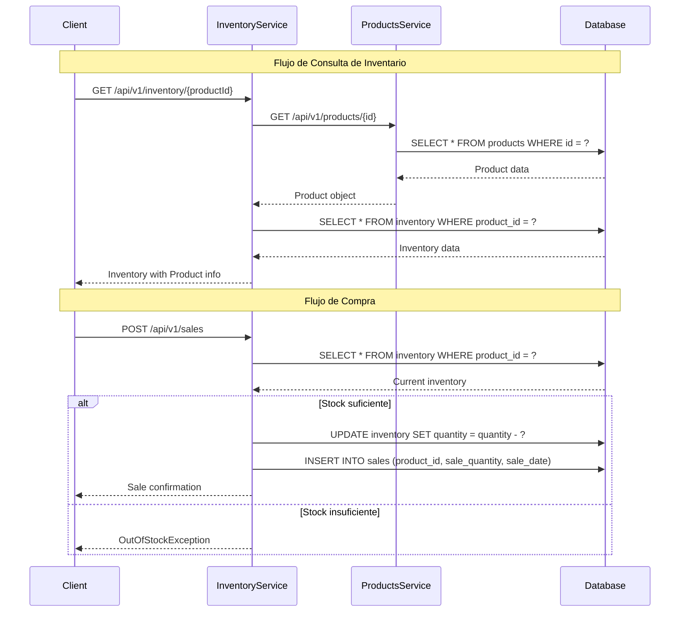

# Sistema de Microservicios - Gestión de Productos e Inventario

## 📋 Tabla de Contenidos

- [Descripción General](#descripción-general)
- [Arquitectura del Sistema](#arquitectura-del-sistema)
- [Instrucciones de Instalación y Ejecución](#instrucciones-de-instalación-y-ejecución)
- [Decisiones Técnicas y Justificaciones](#decisiones-técnicas-y-justificaciones)
- [Diagrama de Interacción entre Servicios](#diagrama-de-interacción-entre-servicios)
- [Flujo de Compra Implementado](#flujo-de-compra-implementado)
- [Documentación de Herramientas de IA](#documentación-de-herramientas-de-ia)
- [API Documentation](#api-documentation)
- [Monitoreo y Health Checks](#monitoreo-y-health-checks)

## 🎯 Descripción General

Este proyecto implementa un sistema de microservicios para la gestión de productos e inventario, compuesto por dos servicios independientes que trabajan en conjunto para proporcionar funcionalidades completas de e-commerce:

- **Products Service**: Gestiona el catálogo de productos
- **Inventory Service**: Administra el inventario y procesa las ventas

## 🏗️ Arquitectura del Sistema

### Estructura de Microservicios

```
┌─────────────────────────────────────────────────────────────┐
│                    Sistema de Microservicios                │
├─────────────────────────────────────────────────────────────┤
│                                                             │
│  ┌─────────────────┐    ┌─────────────────────────────────┐ │
│  │ Products Service│    │      Inventory Service          │ │
│  │                 │    │                                 │ │
│  │ • Gestión de    │    │ • Gestión de Inventario         │ │
│  │   Productos     │◄──►│ • Procesamiento de Ventas       │ │
│  │ • CRUD          │    │ • Validación de Stock           │ │
│  │ • Validaciones  │    │ • Integración con Products      │ │
│  └─────────────────┘    └─────────────────────────────────┘ │
│                                                             │
│  ┌─────────────────────────────────────────────────────────┐ │
│  │                Base de Datos PostgreSQL                 │ │
│  │                                                         │ │
│  │ • Tabla: products                                       │ │
│  │ • Tabla: inventory                                      │ │
│  │ • Tabla: sales                                          │ │
│  └─────────────────────────────────────────────────────────┘ │
└─────────────────────────────────────────────────────────────┘
```

### Tecnologías Utilizadas

| Componente | Tecnología | Versión |
|------------|------------|---------|
| **Framework** | Spring Boot | 3.3.1 / 3.2.6 |
| **Java** | OpenJDK | 17 |
| **Base de Datos** | PostgreSQL | 16-alpine |
| **Comunicación** | OpenFeign | 2023.0.1 |
| **Resiliencia** | Resilience4j | 2.2.0 |
| **Documentación** | OpenAPI 3 | 2.6.0 |
| **Validación** | Bean Validation | 3.0 |
| **Mapping** | MapStruct | 1.5.5 |
| **Logging** | Lombok + SLF4J | - |
| **Contenedores** | Docker & Docker Compose | 3.8 |

## 🚀 Instrucciones de Instalación y Ejecución

### Prerrequisitos

- Java 17 o superior
- Docker y Docker Compose
- Maven o Gradle (incluido en el proyecto)

### Ejecución con Docker Compose (Recomendado)

1. **Clonar el repositorio**
   ```bash
   git clone <repository-url>
   cd prueba-linktic
   ```

2. **Ejecutar el sistema completo**
   ```bash
   # Ejecutar en segundo plano (recomendado)
   docker-compose up -d
   
   # O ejecutar en primer plano para ver logs
   docker-compose up
   ```

3. **Verificar que los servicios estén funcionando**
   ```bash
   docker-compose ps
   ```

4. **Ver logs de los servicios**
   ```bash
   # Ver logs de todos los servicios
   docker-compose logs
   
   # Ver logs de un servicio específico
   docker-compose logs products-service
   docker-compose logs inventory-service
   
   # Seguir logs en tiempo real
   docker-compose logs -f
   ```

5. **Comandos útiles adicionales**
   ```bash
   # Detener todos los servicios
   docker-compose down
   
   # Detener y eliminar volúmenes
   docker-compose down -v
   
   # Reconstruir imágenes
   docker-compose build
   
   # Reiniciar un servicio específico
   docker-compose restart inventory-service
   ```

### Ejecución Local

1. **Configurar la base de datos PostgreSQL**
   ```bash
   docker run -d --name postgres-db \
     -e POSTGRES_USER=postgres \
     -e POSTGRES_PASSWORD=postgres \
     -e POSTGRES_DB=microdb \
     -p 5432:5432 \
     postgres:16-alpine
   ```

2. **Ejecutar Products Service**
   ```bash
   cd modules/products-service
   ./gradlew bootRun
   ```

3. **Ejecutar Inventory Service**
   ```bash
   cd modules/inventory-service
   ./gradlew bootRun
   ```

### Variables de Entorno

#### Products Service
| Variable | Descripción | Valor por Defecto | Valor en Docker |
|----------|-------------|-------------------|-----------------|
| `SPRING_DATASOURCE_URL` | URL de conexión a PostgreSQL | `jdbc:postgresql://localhost:5432/microdb` | `jdbc:postgresql://host.docker.internal:5432/microdb` |
| `SPRING_DATASOURCE_USERNAME` | Usuario de PostgreSQL | `postgres` | `postgres` |
| `SPRING_DATASOURCE_PASSWORD` | Contraseña de PostgreSQL | `postgres` | `postgres` |
| `PRODUCTS_API_KEY` | API Key para Products Service | `key` | `key` |

#### Inventory Service
| Variable | Descripción | Valor por Defecto | Valor en Docker |
|----------|-------------|-------------------|-----------------|
| `SPRING_DATASOURCE_URL` | URL de conexión a PostgreSQL | `jdbc:postgresql://localhost:5432/microdb` | `jdbc:postgresql://host.docker.internal:5432/microdb` |
| `SPRING_DATASOURCE_USERNAME` | Usuario de PostgreSQL | `postgres` | `postgres` |
| `SPRING_DATASOURCE_PASSWORD` | Contraseña de PostgreSQL | `postgres` | `postgres` |
| `INVENTORY_API_KEY` | API Key para Inventory Service | `key-inventory` | `key-inventory` |
| `PRODUCTS_API_KEY` | API Key para Products Service | `key` | `key` |
| `PRODUCTS_HOST` | URL del Products Service | `http://localhost:8080` | `http://products-service:8080` |

#### Base de Datos PostgreSQL
| Variable | Descripción | Valor en Docker |
|----------|-------------|-----------------|
| `POSTGRES_USER` | Usuario de PostgreSQL | `postgres` |
| `POSTGRES_PASSWORD` | Contraseña de PostgreSQL | `postgres` |
| `POSTGRES_DB` | Nombre de la base de datos | `microdb` |

## 🔧 Decisiones Técnicas y Justificaciones

### 1. **Arquitectura de Microservicios**

**Decisión**: Implementación de dos microservicios independientes con responsabilidades bien definidas.

**Justificación**:
- **Escalabilidad**: Cada servicio puede escalar independientemente según la demanda
- **Mantenibilidad**: Código más organizado y fácil de mantener
- **Tecnología**: Permite usar diferentes tecnologías para cada servicio si es necesario
- **Falla aislada**: Un fallo en un servicio no afecta al otro

### 2. **Implementación del Endpoint de Compra en Inventory Service**

**Decisión**: El endpoint de compra (`POST /api/v1/sales`) se implementó en el **Inventory Service**.

**Justificación**:
- **Responsabilidad única**: El Inventory Service es responsable de gestionar el stock y las transacciones
- **Consistencia de datos**: Evita problemas de sincronización entre servicios
- **Transaccionalidad**: Permite operaciones atómicas (validar stock + actualizar inventario + registrar venta)
- **Integridad**: Garantiza que no se vendan productos sin stock disponible

### 3. **Comunicación entre Servicios**

**Decisión**: Uso de OpenFeign para comunicación HTTP síncrona.

**Justificación**:
- **Simplicidad**: Más fácil de implementar que mensajería asíncrona
- **Consistencia**: Respuestas inmediatas para validaciones críticas
- **Resiliencia**: Implementación de circuit breakers y retry patterns

### 4. **Patrones de Resiliencia**

**Decisión**: Implementación de Circuit Breaker y Retry patterns con Resilience4j.

**Justificación**:
- **Tolerancia a fallos**: El sistema continúa funcionando aunque un servicio falle
- **Experiencia de usuario**: Respuestas más rápidas y confiables
- **Monitoreo**: Mejor observabilidad del estado de los servicios

### 5. **Seguridad con API Keys**

**Decisión**: Implementación de autenticación basada en API Keys.

**Justificación**:
- **Simplicidad**: Fácil de implementar y mantener
- **Rendimiento**: Sin overhead de JWT o OAuth
- **Control de acceso**: Permite control granular de acceso a endpoints

## 🔄 Diagrama de Interacción entre Servicios



## 🛒 Flujo de Compra Implementado

### 1. **Recepción de la Solicitud de Compra**

```java
@PostMapping()
public ResponseEntity<Sales> updateInventoryProduct(@RequestBody @Valid Sales sales) {
    iSalesService.createSale(sales);
    return ResponseEntity.ok(sales);
}
```

### 2. **Validación de Stock**

El servicio verifica si hay suficiente inventario disponible:

```java
Inventory currentInventory = inventoryService.findByProductId(sales.getProductoId());

if (currentInventory.getCantidad() >= sales.getCantidadCompra()) {
    // Procesar la venta
} else {
    throw new OutOfStockException("No hay suficiente stock disponible");
}
```

### 3. **Actualización Transaccional del Inventario**

```java
@Transactional
public void createSale(Sales sales) {
    // Validar stock
    // Actualizar inventario
    inventoryService.updateInventoryByProduct(Inventory.builder()
        .cantidad(currentInventory.getCantidad() - sales.getCantidadCompra())
        .productoId(sales.getProductoId())
        .build());
    
    // Registrar la venta
    salesRepository.save(SalesEntity.builder()
        .productId(sales.getProductoId())
        .saleQuantity(sales.getCantidadCompra())
        .saleDate(LocalDateTime.now())
        .build());
}
```

### 4. **Manejo de Errores**

- **Stock insuficiente**: Retorna `409 Conflict` con mensaje descriptivo
- **Producto no encontrado**: Retorna `404 Not Found`
- **Errores de validación**: Retorna `400 Bad Request` con detalles

## 🤖 Documentación de Herramientas de IA

### Herramientas Utilizadas

#### 1. **GitHub Copilot**
- **Tareas específicas**: 
  - Generación de código boilerplate para entidades y DTOs
  - Implementación de métodos CRUD básicos
  - Generación de anotaciones de validación
  - Creación de constructores y getters/setters con Lombok

- **Verificación de calidad**:
  - Revisión manual de cada sugerencia antes de aceptar
  - Validación de que el código generado sigue las convenciones del proyecto
  - Pruebas unitarias para verificar funcionalidad

#### 2. **ChatGPT (Claude/GPT-4)**
- **Tareas específicas**:
  - Diseño de arquitectura de microservicios
  - Implementación de patrones de resiliencia (Circuit Breaker, Retry)
  - Configuración de OpenFeign y Resilience4j
  - Generación de documentación técnica
  - Resolución de problemas de configuración

- **Verificación de calidad**:
  - Implementación incremental con pruebas en cada paso
  - Validación de configuraciones con logs de aplicación
  - Verificación de que las dependencias son compatibles

#### 3. **Intellij IDEA, CURSOR IDE**
- **Tareas específicas**:
  - Refactoring de código
  - Generación de tests unitarios
  - Optimización de imports y estructura de código
  - Detección de problemas de seguridad y rendimiento

- **Verificación de calidad**:
  - Ejecución de tests automatizados
  - Análisis estático de código
  - Verificación de cobertura de código

### Proceso de Verificación

1. **Revisión de Código**: Todo el código generado por IA fue revisado manualmente
2. **Tests Unitarios**: Implementación de tests para validar funcionalidad
3. **Tests de Integración**: Verificación de comunicación entre servicios
4. **Análisis de Cobertura**: Uso de JaCoCo para asegurar cobertura mínima del 80%
5. **Validación de Configuración**: Verificación de que todas las configuraciones funcionan correctamente

## 🔗 API Documentation

### 📖 Swagger UI - Documentación Interactiva

Ambos servicios incluyen documentación interactiva completa con Swagger UI:

| Servicio | URL de Documentación | Puerto |
|----------|---------------------|--------|
| **Products Service** | http://localhost:8081/swagger-ui.html | 8081 |
| **Inventory Service** | http://localhost:8082/swagger-ui.html | 8082 |

> **⚠️ Importante**: Todos los endpoints requieren autenticación mediante API Key en el header `x-api-key`

### 🔑 Autenticación

#### API Keys Requeridas

| Servicio | API Key | Header |
|----------|---------|--------|
| **Products Service** | `key` | `x-api-key: key` |
| **Inventory Service** | `key-inventory` | `x-api-key: key-inventory` |

#### Headers Obligatorios

```http
x-api-key: <api-key-value>
Content-Type: application/json
```

### 📋 Endpoints Disponibles

#### 🛍️ Products Service

| Endpoint | Método | Descripción | Autenticación |
|----------|--------|-------------|---------------|
| `POST /api/v1/products` | POST | Crear nuevo producto | `x-api-key: key` |
| `GET /api/v1/products/{id}` | GET | Obtener producto por ID | `x-api-key: key` |
| `GET /api/v1/products` | GET | Obtener todos los productos | `x-api-key: key` |

#### 📦 Inventory Service

| Endpoint | Método | Descripción | Autenticación |
|----------|--------|-------------|---------------|
| `GET /api/v1/inventory/{productId}` | GET | Obtener inventario por producto | `x-api-key: key-inventory` |
| `PUT /api/v1/inventory` | PUT | Actualizar inventario | `x-api-key: key-inventory` |
| `POST /api/v1/sales` | POST | Procesar venta | `x-api-key: key-inventory` |

### 🚀 Ejemplos de Uso

#### Crear un Producto
```bash
curl -X POST http://localhost:8081/api/v1/products \
  -H "x-api-key: key" \
  -H "Content-Type: application/json" \
  -d '{
    "nombre": "Laptop Gaming",
    "precio": 1299.99,
    "descripcion": "Laptop para gaming de alto rendimiento"
  }'
```

#### Obtener Inventario de un Producto
```bash
curl -X GET http://localhost:8082/api/v1/inventory/1 \
  -H "x-api-key: key-inventory"
```

#### Procesar una Venta
```bash
curl -X POST http://localhost:8082/api/v1/sales \
  -H "x-api-key: key-inventory" \
  -H "Content-Type: application/json" \
  -d '{
    "productoId": 1,
    "cantidadCompra": 2.0
  }'
```

### 🔍 Cómo Usar Swagger UI

1. **Acceder a la documentación**:
   - Products: http://localhost:8081/swagger-ui.html
   - Inventory: http://localhost:8082/swagger-ui.html

2. **Configurar autenticación**:
   - Hacer clic en el botón "Authorize" (🔒)
   - Ingresar el API Key correspondiente
   - Hacer clic en "Authorize"

3. **Probar endpoints**:
   - Expandir el endpoint deseado
   - Hacer clic en "Try it out"
   - Completar los parámetros requeridos
   - Hacer clic en "Execute"

## 📊 Monitoreo y Health Checks

### 🔍 Endpoints de Monitoreo

Ambos servicios exponen endpoints de health check para monitoreo:

| Endpoint | Descripción | Ejemplo |
|----------|-------------|---------|
| `GET /actuator/health` | Estado general del servicio | http://localhost:8081/actuator/health |
| `GET /actuator/info` | Información del servicio | http://localhost:8081/actuator/info |

### 📈 Métricas Disponibles

- **Estado de la base de datos**: Conexión y disponibilidad
- **Estado de las conexiones a servicios externos**: Comunicación entre microservicios
- **Métricas de circuit breaker**: Estado de los patrones de resiliencia
- **Métricas de retry**: Intentos de reconexión

### 🌐 Puertos y URLs de Acceso

| Servicio | Puerto Externo | Puerto Interno | Descripción | Swagger UI |
|----------|----------------|----------------|-------------|------------|
| **Products Service** | 8081 | 8080 | API de productos | http://localhost:8081/swagger-ui.html |
| **Inventory Service** | 8082 | 8081 | API de inventario y ventas | http://localhost:8082/swagger-ui.html |
| **PostgreSQL** | 5432 | 5432 | Base de datos | - |

#